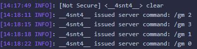
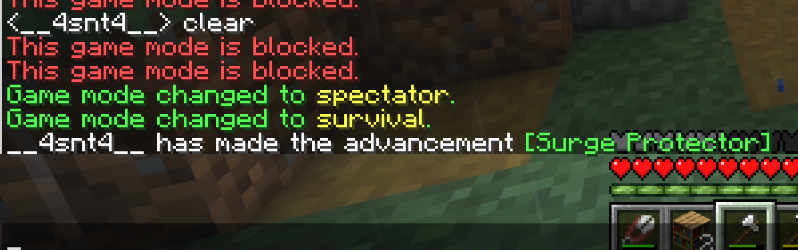
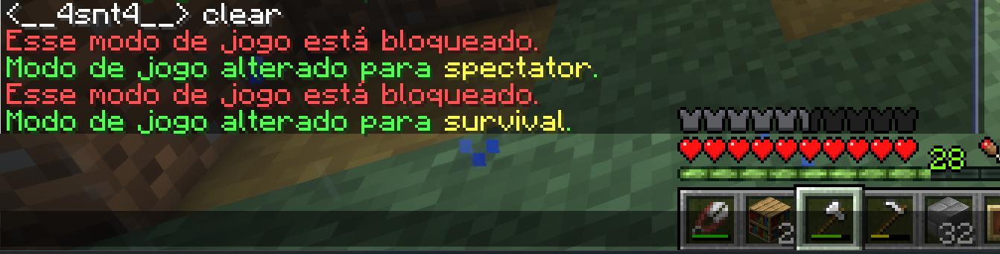

# SimpleGamemode

A lightweight and configurable Spigot plugin that allows players to change their game mode using the `/gm` command — with optional restrictions defined in a simple config file.

## Features

- Supports `/gm <0|1|2|3>` for quick gamemode switching:
  - `0`: Survival
  - `1`: Creative
  - `2`: Adventure
  - `3`: Spectator
- Blocks specific gamemodes via config (`config.yml`)
- Permission-based access (`simplegamemode.use`)
- Supports messages in **English (en)** and **Portuguese (pt)** via `messages.yml`
- Minimal and clean implementation
- Fully open-source

## Screenshot

 <!-- Optional image -->
 <!-- Optional image -->
 <!-- Optional image -->
## ⚙️ Configuration

```yaml
# config.yml
blocked-gamemodes:
- creative
- spectator
```

You can block any of the following gamemodes by adding them to the list:
- `survival`
- `creative`
- `adventure`
- `spectator`

## 🗣️ Language Support

The plugin supports multiple languages via `messages.yml`.

To change the language, open `messages.yml` and set:

```yaml
language: pt  # or 'en'
```

Available languages:
- `en` → English (default)
- `pt` → Portuguese

## Permissions

| Permission | Description | Default |
|--------------------------|---------------------------------|---------|
| `simplegamemode.use` | Allows using `/gm` command | `op` |

## Commands

| Command | Description |
|------------------|---------------------------------------|
| `/gm <0|1|2|3>` | Switches your game mode |

## Usage

- Only players can use the command.
- The plugin checks if the chosen gamemode is blocked in `config.yml`.
- Shows feedback messages and prevents misuse.

## Requirements

- Minecraft Server: **1.20.1+**
- Java: **17+**
- Tested with **Spigot** and **Purpur**

## Installation

1. Download the latest release `.jar` from the [Releases](https://github.com/your-username/SimpleGamemode/releases) page.
2. Drop it into your server's `plugins/` folder.
3. Start the server.
4. Customize `config.yml` and `messages.yml` as needed.
5. Give players the appropriate permission.

## Build Instructions (Maven)

To compile the plugin locally:

```bash
git clone https://github.com/your-username/SimpleGamemode.git
cd SimpleGamemode
mvn clean package
```

The output `.jar` will be in the `target/` directory.

## File Structure

```
SimpleGamemode/
├── src/
│   └── main/
│       ├── java/
│       │   └── dev/fndit/simplegamemode/SimpleGamemodePlugin.java
│       └── resources/
│           ├── plugin.yml
│           ├── config.yml
│           └── messages.yml
├── pom.xml
└── README.md
```

## License

This project is open-source and licensed under the [MIT License](LICENSE).

---

Made with ❤️ by [4snt](https://github.com/4snt)
